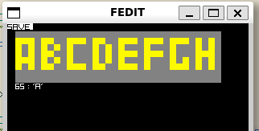

# Font editor
- For editing bitmaps used for verilog $readmem() bit files
  
  

- Feel free to use this for anything... I hope its helpful, let me know in the issues if you do use it somewhere `:)`